# Лабораторная Работа 1

## Задание 1 - Приветствие и возраст
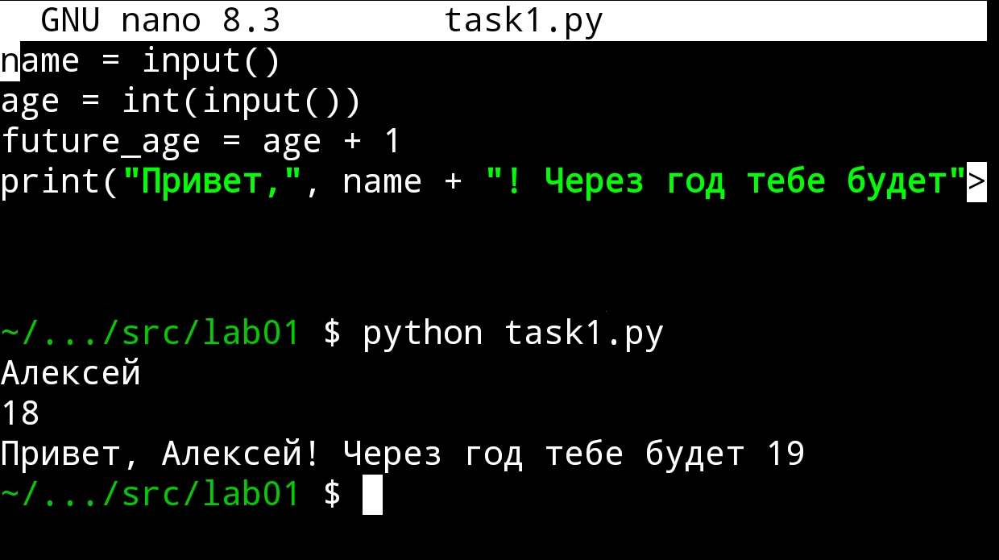

## Задание 2 - Сумма и среднее
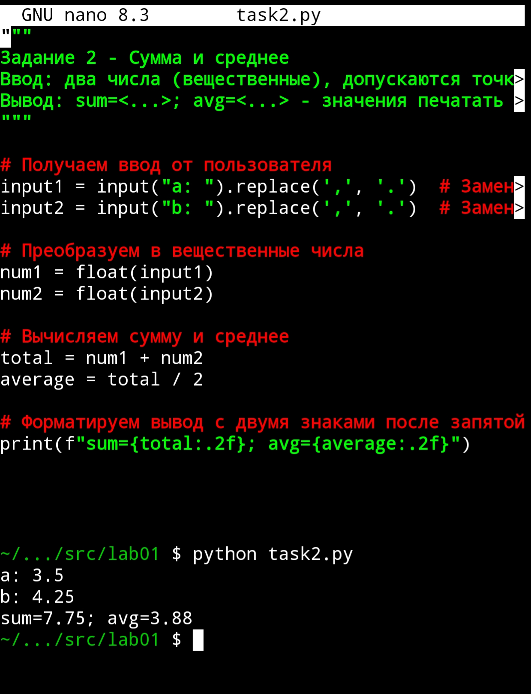

## Задание 3 - Чек: скидка и НДС
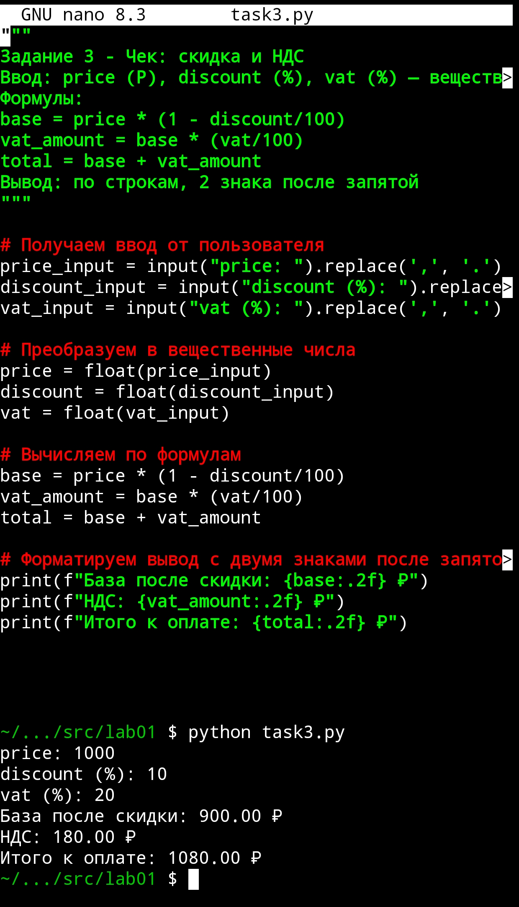

## Задание 4 - Минуты → ЧЧ:ММ
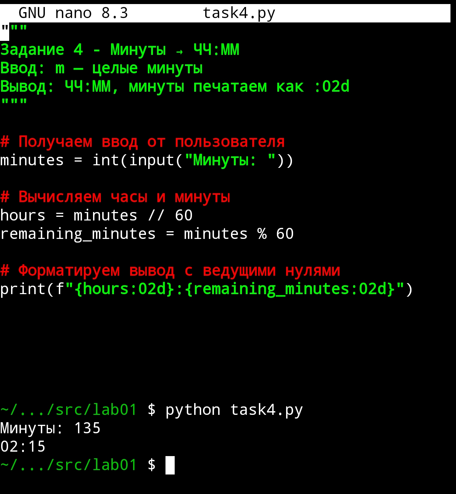

## Задание 5 - Инициалы и длина строки
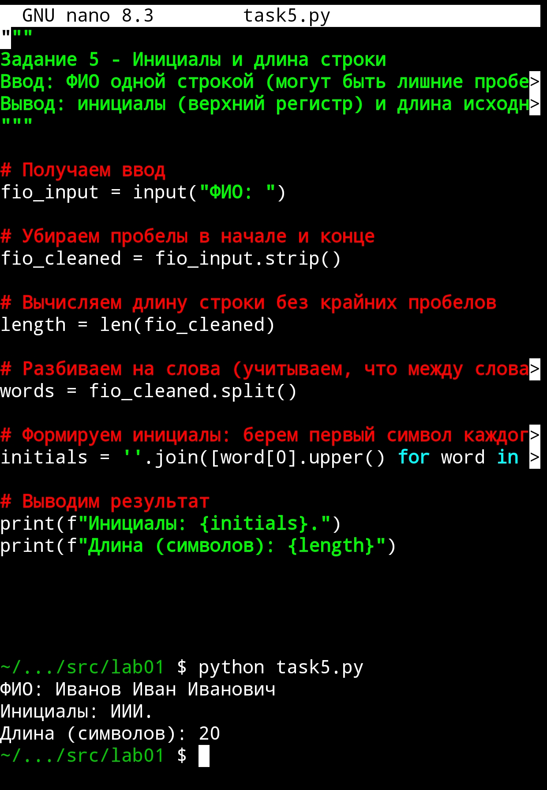

## Задание 6* - Подсчет участников
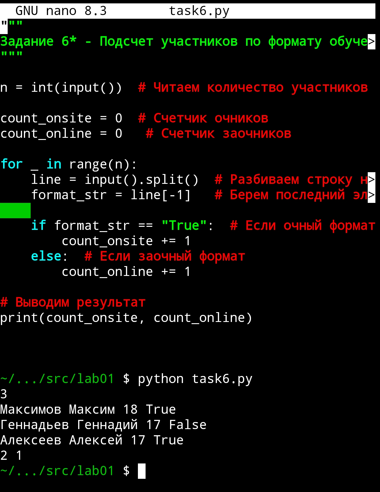

## Задание 7* - Расшифровка строки
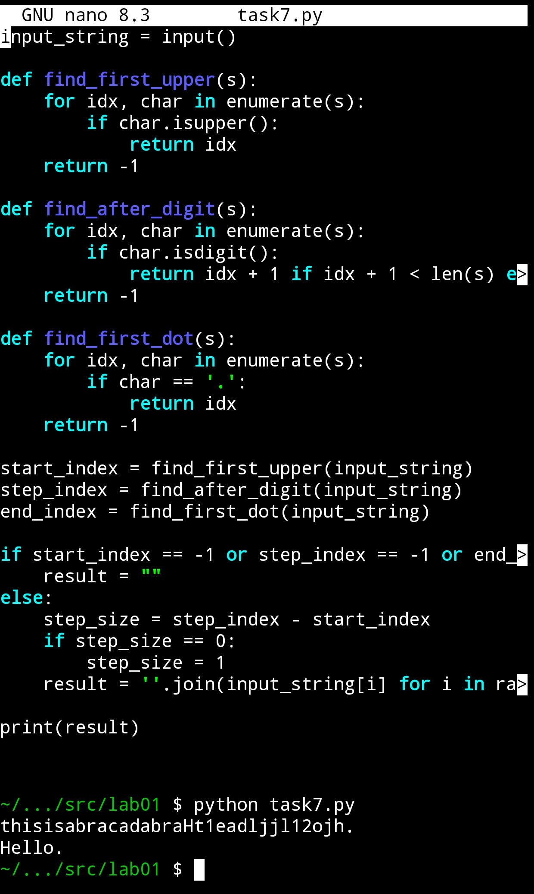

## Лабораторная работа 2 

### Задание 1 - Реализовать функции

### Код
```python
# task1.py

from typing import List, Any, Union, Tuple

Number = Union[int, float]

def min_max(nums: List[Number]) -> Tuple[Number, Number]:
    if not nums:
        raise ValueError("Пустой список")
    return min(nums), max(nums)

def unique_sorted(nums: List[Number]) -> List[Number]:
    seen = {}
    for x in nums:
        k = float(x)
        if k not in seen:
            seen[k] = x
    return [seen[k] for k in sorted(seen.keys())]

def flatten(mat: List[Union[List[Any], tuple]]) -> List[Any]:
    out = []
    for row in mat:
        if isinstance(row, str):
            raise TypeError("строка не строка строк матрицы")
        if not isinstance(row, (list, tuple)):
            raise TypeError("элемент матрицы не является списком/кортежем")
        out.extend(row)
    return out

if __name__ == "__main__":
    cases = [
        ("min_max", [3, -1, 5, 5, 0]),
        ("min_max", [42]),
        ("min_max", [-5, -2, -9]),
        ("min_max", []),
        ("min_max", [1.5, 2, 2.0, -3.1]),

        ("unique_sorted", [3, 1, 2, 1, 3]),
        ("unique_sorted", []),
        ("unique_sorted", [-1, -1, 0, 2, 2]),
        ("unique_sorted", [1.0,1,2.5,2.5,0]),

        ("flatten", [[1,2],[3,4]]),
        ("flatten", [[1,2], (3,4,5)]),
        ("flatten", [[1], [], [2,3]]),
        ("flatten", [[1,2], "ab"]),
    ]

    funcs = {"min_max": min_max, "unique_sorted": unique_sorted, "flatten": flatten}

    for fname in ("min_max", "unique_sorted", "flatten"):
        print(fname)
        for name, inp in cases:
            if name != fname:
                continue
            try:
                res = funcs[name](inp)
                print(f"{inp!r} -> {res!r}")
            except Exception as e:
                print(f"{inp!r} -> {type(e).__name__}: {e}")
        print()  # пустая строка между функциями
```

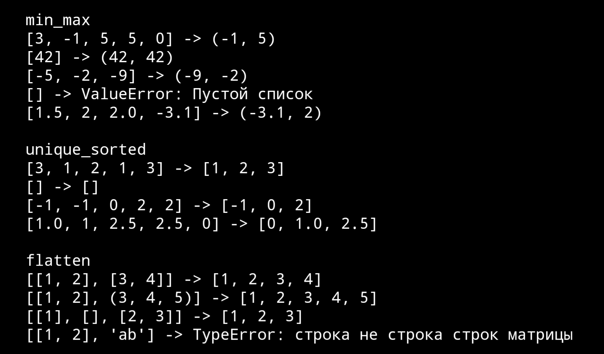

### Задание 2

### Код
```python
# task2.py

from typing import List, Union

Number = Union[int, float]

def _check_rect(mat: List[List[Number]]):
    if not mat:
        return
    n = len(mat[0])
    for row in mat:
        if len(row) != n:
            raise ValueError("рваная матрица")

def transpose(mat: List[List[Number]]) -> List[List[Number]]:
    if not mat:
        return []
    _check_rect(mat)
    # zip(*mat) даёт колонки; превращаем в списки
    return [list(col) for col in zip(*mat)]

def row_sums(mat: List[List[Number]]) -> List[Number]:
    _check_rect(mat)
    return [sum(row) for row in mat]

def col_sums(mat: List[List[Number]]) -> List[Number]:
    _check_rect(mat)
    if not mat:
        return []
    return [sum(col) for col in zip(*mat)]

if __name__ == "__main__":
    cases = [
        ("transpose", [[1, 2, 3]]),
        ("transpose", [[1], [2], [3]]),
        ("transpose", [[1, 2], [3, 4]]),
        ("transpose", []),
        ("transpose", [[1, 2], [3]]),

        ("row_sums", [[1, 2, 3], [4, 5, 6]]),
        ("row_sums", [[-1, 1], [10, -10]]),
        ("row_sums", [[0, 0], [0, 0]]),
        ("row_sums", [[1, 2], [3]]),

        ("col_sums", [[1, 2, 3], [4, 5, 6]]),
        ("col_sums", [[-1, 1], [10, -10]]),
        ("col_sums", [[0, 0], [0, 0]]),
        ("col_sums", [[1, 2], [3]]),
    ]

    funcs = {"transpose": transpose, "row_sums": row_sums, "col_sums": col_sums}

    for fname in ("transpose", "row_sums", "col_sums"):
        print(fname)
        for name, inp in cases:
            if name != fname:
                continue
            try:
                res = funcs[name](inp)
                print(f"{inp!r} -> {res!r}")
            except Exception as e:
                print(f"{inp!r} -> {type(e).__name__}: {e}")
        print()
```

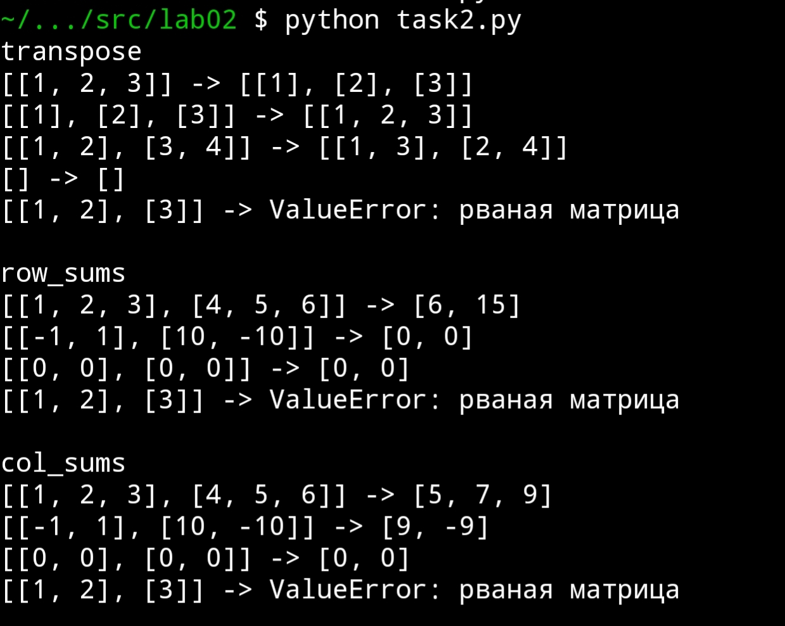

### Задание 3

### Код
```python
# tuples.py

from typing import Tuple

def format_record(rec: Tuple[str, str, float]) -> str:
    if not isinstance(rec, tuple) or len(rec) != 3:
        raise TypeError("record must be tuple (fio, group, gpa)")
    fio, group, gpa = rec
    if not isinstance(fio, str) or not fio.strip():
        raise ValueError("пустое ФИО")
    if not isinstance(group, str) or not group.strip():
        raise ValueError("пустая группа")
    if not isinstance(gpa, (int, float)):
        raise TypeError("GPA должен быть числом")

    parts = fio.split()  # split() уже убирает лишние пробелы
    if len(parts) < 2:
        raise ValueError("ФИО должно содержать как минимум фамилию и имя")

    surname = parts[0].lower().capitalize()
    names = parts[1:3]  # 1–2 имени для инициалов
    initials = "".join((n[0].upper() + ".") for n in names if n)

    return f"{surname} {initials}, гр. {group.strip()}, GPA {gpa:.2f}"


if __name__ == "__main__":
    cases = [
        ("Иванов Иван Иванович", "BIVT-25", 4.6),
        ("Петров Пётр", "IKBO-12", 5.0),
        ("Петров Пётр Петрович", "IKBO-12", 5.0),
        ("  сидорова  анна   сергеевна ", "ABB-01", 3.999),
        # несколько негативных для демонстрации
        ("", "G-1", 4.0),
        ("Иванов", "G-1", 4.0),
        ("Иванов Иван", "", 4.0),
        ("Иванов Иван", "G-1", "badgpa"),
    ]

    print("format_record")
    for rec in cases:
        try:
            out = format_record(rec)
            print(f"{rec!r} -> {out!r}")
        except Exception as e:
            print(f"{rec!r} -> {type(e).__name__}: {e}")
```


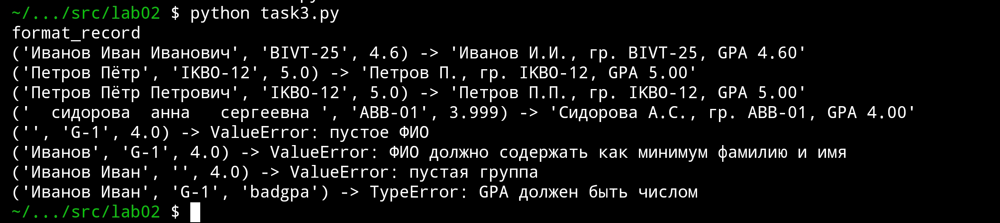


# Лабораторная Работа 3


### Задание 1

### Код
```python
import re
from collections import Counter

def normalize(text: str, *, casefold: bool = True, yo2e: bool = True) -> str:
    if casefold:
        text = text.casefold()
    if yo2e:
        text = text.replace('ё', 'е').replace('Ё', 'е')
    text = re.sub(r'[\t\r\n]+', ' ', text)
    return re.sub(r' +', ' ', text.strip())

def tokenize(text: str) -> list[str]:
    return re.findall(r'\w+(?:-\w+)*', text)

def count_freq(tokens: list[str]) -> dict[str, int]:
    return dict(Counter(tokens))

def top_n(freq: dict[str, int], n: int = 5) -> list[tuple[str, int]]:
    return sorted(freq.items(), key=lambda x: (-x[1], x[0]))[:n]

# Убираем тестовый код или оборачиваем в if __name__
if __name__ == "__main__":
    # Тестовый код только при прямом запуске
    text = "ПрИвЕт\nМИр\tёжик"
    normalized = normalize(text)
    tokens = tokenize(normalized)
    freq = count_freq(tokens)
    top = top_n(freq, 3)

    print("Нормализовано:", normalized)
    print("Токены:", tokens)
    print("Частоты:", freq)
    print("Топ-3:", top)
```

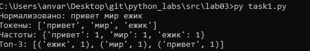

### Задание 2

### Код
```python
import sys
from task1 import normalize, tokenize, count_freq, top_n

# Читаем с правильной кодировкой
text = sys.stdin.buffer.read().decode('utf-8')

normalized_text = normalize(text)
tokens = tokenize(normalized_text)
freq = count_freq(tokens)

print(f"Всего слов: {len(tokens)}")
print(f"Уникальных слов: {len(freq)}")
print("Топ-5:")

for word, count in top_n(freq, 5):
    print(f"{word}:{count}") 
```

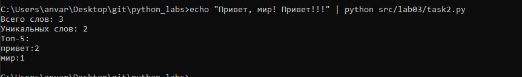


# Лабораторная Работа 4


### Задание 1

### Код
```python
import csv
from pathlib import Path
from typing import Union

def read_text(path: Union[str, Path], encoding: str = "utf-8") -> str:
    """
    Читает содержимое текстового файла и возвращает его как одну строку.
    
    """
    with open(path, 'r', encoding=encoding) as file:
        return file.read()

def write_csv(rows: list[Union[tuple, list]], 
              path: Union[str, Path], 
              header: tuple[str, ...] | None = None) -> None:
    """
    Создает или перезаписывает CSV файл с разделителем ','.
    
    """
    # Проверяем одинаковую длину всех строк
    if rows:
        first_length = len(rows[0])
        for i, row in enumerate(rows):
            if len(row) != first_length:
                raise ValueError(f"Строка {i} имеет длину {len(row)}, ожидалась {first_length}")
    
    # Создаем родительские директории если нужно
    ensure_parent_dir(path)
    
    with open(path, 'w', encoding='utf-8', newline='') as file:
        writer = csv.writer(file)
        
        if header:
            writer.writerow(header)
        
        writer.writerows(rows)

def ensure_parent_dir(path: Union[str, Path]) -> None:
    """
    Создает родительские директории для указанного пути, если они не существуют.
    
    """
    path_obj = Path(path)
    path_obj.parent.mkdir(parents=True, exist_ok=True)

# Мини-тесты для проверки функций
if __name__ == "__main__":
    # Тест 1: Чтение текстового файла
    try:
        # Создадим тестовый файл для чтения
        test_input_path = Path("data/input.txt")
        ensure_parent_dir(test_input_path)
        with open(test_input_path, 'w', encoding='utf-8') as f:
            f.write("Тестовый тескт для проверки функций")
        
        txt = read_text("data/input.txt")
        print(f"✓ read_text работает: {txt[:20]}...")
    except Exception as e:
        print(f"✗ read_text ошибка: {e}")
    
    # Тест 2: Запись CSV
    try:
        write_csv([("word", "count"), ("test", 3)], "data/check.csv")
        print("✓ write_csv с заголовком в данных работает")
    except Exception as e:
        print(f"✗ write_csv ошибка: {e}")
    
    # Тест 3: Запись CSV с отдельным заголовком
    try:
        write_csv([("test", 3), ("example", 1)], "data/check2.csv", header=("word", "count"))
        print("✓ write_csv с отдельным header работает")
    except Exception as e:
        print(f"✗ write_csv с header ошибка: {e}")
    
    # Тест 4: Проверка ошибки разной длины строк
    try:
        write_csv([("a", "b"), ("c",)], "data/error.csv")
        print("✗ Должна была быть ошибка разной длины")
    except ValueError as e:
        print(f"✓ Корректно обработана ошибка разной длины: {e}")
    
    # Тест 5: Пустой файл
    try:
        empty_content = read_text("data/empty.txt")
        print(f"✓ Пустой файл работает: '{empty_content}'")
    except FileNotFoundError:
        print("✓ Файл не найден - ожидаемо")
    except Exception as e:
        print(f"✗ Ошибка с пустым файлом: {e}")
    
    print("\nВсе тесты завершены!")
```

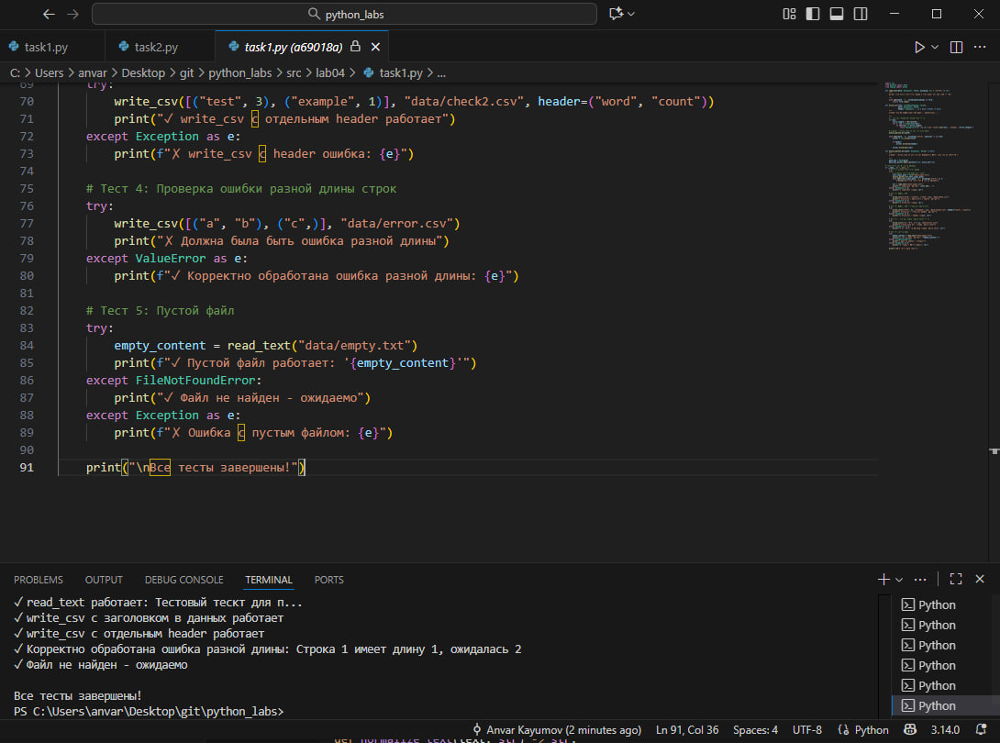

### Задание 2

### Код
```python
import argparse
import sys
from pathlib import Path
from collections import Counter
from typing import List, Tuple

# Импортируем функции из task1
from task1 import read_text, write_csv

def normalize_text(text: str) -> str:
    """
    Нормализует текст: приводит к нижнему регистру, заменяет ё на е,
    заменяет управляющие символы на пробелы, схлопывает пробелы.
    """
    if not text:
        return ""
    
    text = text.casefold()
    text = text.replace('ё', 'е')
    text = text.replace('\t', ' ').replace('\r', ' ').replace('\n', ' ')
    
    # Схлопываем множественные пробелы
    while '  ' in text:
        text = text.replace('  ', ' ')
    
    return text.strip()

def tokenize(text: str) -> List[str]:
    """
    Токенизирует нормализованный текст на слова.
    """
    import re
    if not text:
        return []
    
    # \w+(?:-\w+)* - слова, возможно с дефисами внутри
    pattern = r'\w+(?:-\w+)*'
    return re.findall(pattern, text)

def calculate_word_frequencies(tokens: List[str]) -> List[Tuple[str, int]]:
    """
    Подсчитывает частоты слов и сортирует по убыванию частоты
    а при равных частотах по возрастанию слова
    """
    if not tokens:
        return []
    
    counter = Counter(tokens)
    # Сортировка: сначала по убыванию частоты, потом по возрастанию слова
    return sorted(counter.items(), key=lambda x: (-x[1], x[0]))

def print_summary(tokens: List[str], top_words: List[Tuple[str, int]], top_n: int = 5) -> None:
    """
    Выводит краткую статистику в консоль.
    """
    total_words = len(tokens)
    unique_words = len(set(tokens))
    
    print(f"Всего слов: {total_words}")
    print(f"Уникальных слов: {unique_words}")
    print(f"Топ-{min(top_n, len(top_words))}: {[word for word, count in top_words[:top_n]]}")

def main():
    """Основная функция скрипта."""
    parser = argparse.ArgumentParser(description='Анализ текста и генерация отчета о частотах слов')
    parser.add_argument('--in', dest='input_file', default='data/input.txt',
                       help='Входной текстовый файл (по умолчанию: data/input.txt)')
    parser.add_argument('--out', dest='output_file', default='data/report.csv',
                       help='Выходной CSV файл (по умолчанию: data/report.csv)')
    parser.add_argument('--encoding', default='utf-8',
                       help='Кодировка файлов (по умолчанию: utf-8, для Windows: cp1251)')
    parser.add_argument('--top', type=int, default=5,
                       help='Количество слов для топа (по умолчанию: 5)')
    
    args = parser.parse_args()
    
    try:
        # Чтение входного файла
        text = read_text(args.input_file, args.encoding)
        
        # Обработка текста
        normalized_text = normalize_text(text)
        tokens = tokenize(normalized_text)
        
        # Подсчет частот
        word_frequencies = calculate_word_frequencies(tokens)
        
        # Сохранение отчета
        if word_frequencies:
            write_csv(word_frequencies, args.output_file, header=('word', 'count'))
        else:
            # Если слов нет, создаем файл только с заголовком
            write_csv([], args.output_file, header=('word', 'count'))
        
        # Вывод статистики
        print_summary(tokens, word_frequencies, args.top)
        
        print(f"\nОтчет сохранен в: {args.output_file}")
        
    except FileNotFoundError:
        print(f"Ошибка: Файл '{args.input_file}' не найден.")
        sys.exit(1)
    except UnicodeDecodeError as e:
        print(f"Ошибка кодировки: {e}")
        print("Попробуйте указать правильную кодировку через --encoding (например, --encoding cp1251)")
        sys.exit(1)
    except Exception as e:
        print(f"Неожиданная ошибка: {e}")
        sys.exit(1)

if __name__ == "__main__":
    main()
```

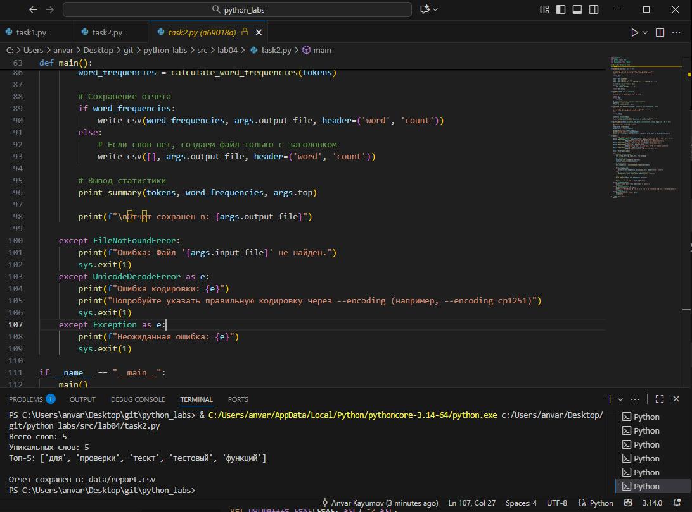

# Лабораторная работа 5

### Задание А

```Python
import json
import csv
from pathlib import Path

def json_to_csv(json_path: str, csv_path: str) -> None:
    """
    Преобразует JSON-файл в CSV.
    """
    # Проверка существования файла
    if not Path(json_path).exists():
        raise FileNotFoundError(f"JSON файл не найден: {json_path}")
    
    # Создание директории для выходного файла если не существует
    Path(csv_path).parent.mkdir(parents=True, exist_ok=True)
    
    # Чтение JSON
    try:
        with open(json_path, 'r', encoding='utf-8') as json_file:
            data = json.load(json_file)
    except json.JSONDecodeError:
        raise ValueError("Неверный формат JSON файла")
    
    # Проверка типа данных
    if not isinstance(data, list):
        raise ValueError("JSON должен содержать список")
    
    if not data:
        raise ValueError("JSON файл пустой")
    
    # Получение всех уникальных ключей (полей)
    all_keys = set()
    for item in data:
        if not isinstance(item, dict):
            raise ValueError("Элементы JSON должны быть словарями")
        all_keys.update(item.keys())
    
    # Сортировка ключей по алфавиту
    fieldnames = sorted(all_keys)
    
    # Запись CSV
    try:
        with open(csv_path, 'w', encoding='utf-8', newline='') as csv_file:
            writer = csv.DictWriter(csv_file, fieldnames=fieldnames)
            writer.writeheader()
            for item in data:
                # Заполняем отсутствующие поля пустыми строками
                row = {key: item.get(key, '') for key in fieldnames}
                writer.writerow(row)
    except Exception as e:
        raise ValueError(f"Ошибка записи CSV: {e}")

def csv_to_json(csv_path: str, json_path: str) -> None:
    """
    Преобразует CSV в JSON (список словарей).
    """
    # Проверка существования файла
    if not Path(csv_path).exists():
        raise FileNotFoundError(f"CSV файл не найден: {csv_path}")
    
    # Создание директории для выходного файла если не существует
    Path(json_path).parent.mkdir(parents=True, exist_ok=True)
    
    data = []
    
    # Чтение CSV
    try:
        with open(csv_path, 'r', encoding='utf-8') as csv_file:
            reader = csv.DictReader(csv_file)
            
            # Проверка наличия заголовков
            if reader.fieldnames is None:
                raise ValueError("CSV файл не содержит заголовков")
            
            for row in reader:
                # Все значения сохраняются как строки
                data.append(row)
                
    except csv.Error:
        raise ValueError("Неверный формат CSV файла")
    
    if not data:
        raise ValueError("CSV файл пустой (только заголовки)")
    
    # Запись JSON
    try:
        with open(json_path, 'w', encoding='utf-8') as json_file:
            json.dump(data, json_file, ensure_ascii=False, indent=2)
    except Exception as e:
        raise ValueError(f"Ошибка записи JSON: {e}")
```
### json to

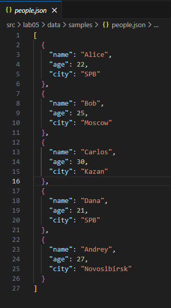 

### csv

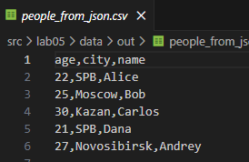 

### and csv to

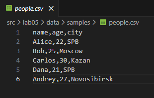

### json 

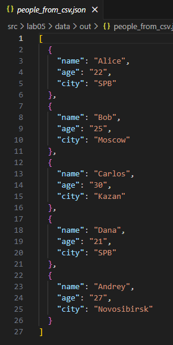

### Задание B
```
import csv
from pathlib import Path

def csv_to_xlsx(csv_path: str, xlsx_path: str) -> None:
    """
    Конвертирует CSV в XLSX используя openpyxl.
    """
    try:
        import openpyxl
        from openpyxl.utils import get_column_letter
    except ImportError:
        raise ImportError("Для работы требуется openpyxl. Установите: pip install openpyxl")
    
    # Проверка существования файла
    if not Path(csv_path).exists():
        raise FileNotFoundError(f"CSV файл не найден: {csv_path}")
    
    # Создание директории для выходного файла если не существует
    Path(xlsx_path).parent.mkdir(parents=True, exist_ok=True)
    
    # Создание новой книги Excel
    workbook = openpyxl.Workbook()
    sheet = workbook.active
    sheet.title = "Sheet1"
    
    # Чтение CSV и запись в XLSX
    try:
        with open(csv_path, 'r', encoding='utf-8') as csv_file:
            reader = csv.reader(csv_file)
            rows = list(reader)
    except csv.Error:
        raise ValueError("Неверный формат CSV файла")
    
    if not rows:
        raise ValueError("CSV файл пустой")
    
    # Запись данных
    for row_idx, row in enumerate(rows, 1):
        for col_idx, value in enumerate(row, 1):
            sheet.cell(row=row_idx, column=col_idx, value=value)
    
    # Настройка авто-ширины колонок
    for column_cells in sheet.columns:
        max_length = 0
        column = column_cells[0].column_letter  # Получаем букву колонки
        
        for cell in column_cells:
            try:
                if len(str(cell.value)) > max_length:
                    max_length = len(str(cell.value))
            except:
                pass
        
        # Минимальная ширина - 8 символов
        adjusted_width = max(max_length + 2, 8)
        sheet.column_dimensions[column].width = adjusted_width
    
    # Сохранение файла
    try:
        workbook.save(xlsx_path)
    except Exception as e:
        raise ValueError(f"Ошибка сохранения XLSX: {e}")
```
### cities.csv to

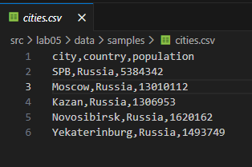

### cities.xlsx

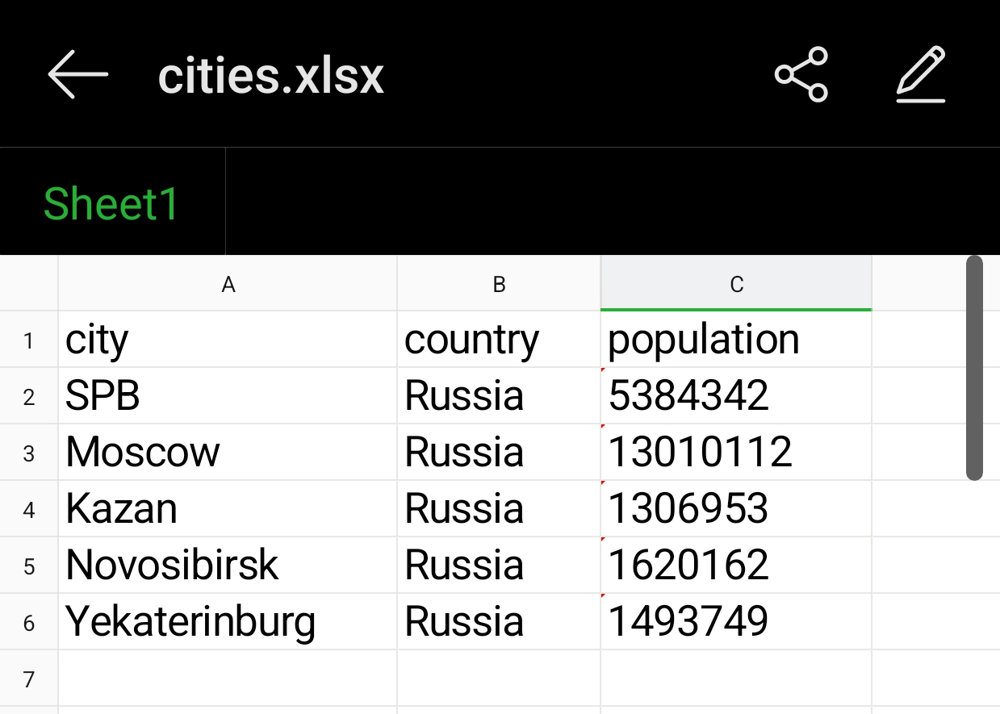