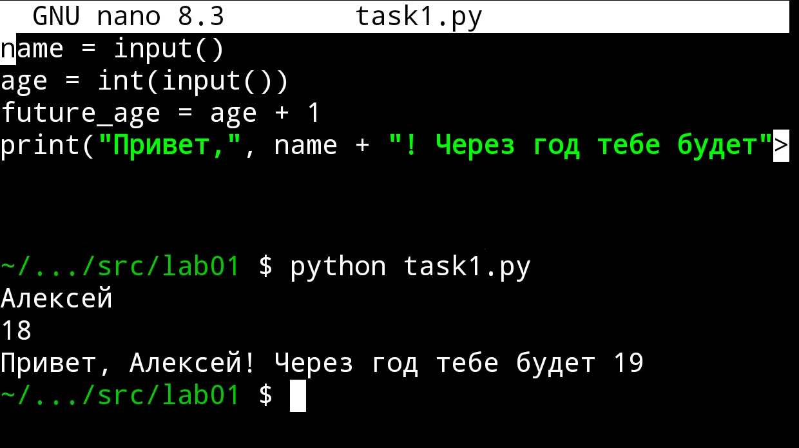
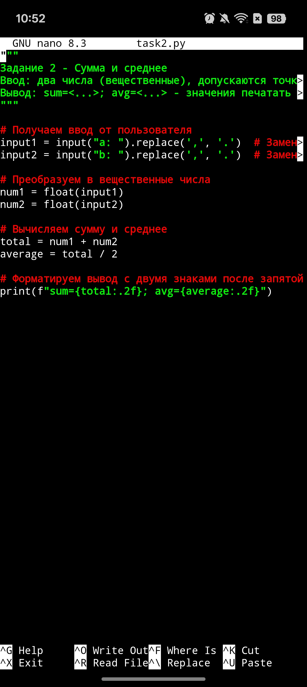
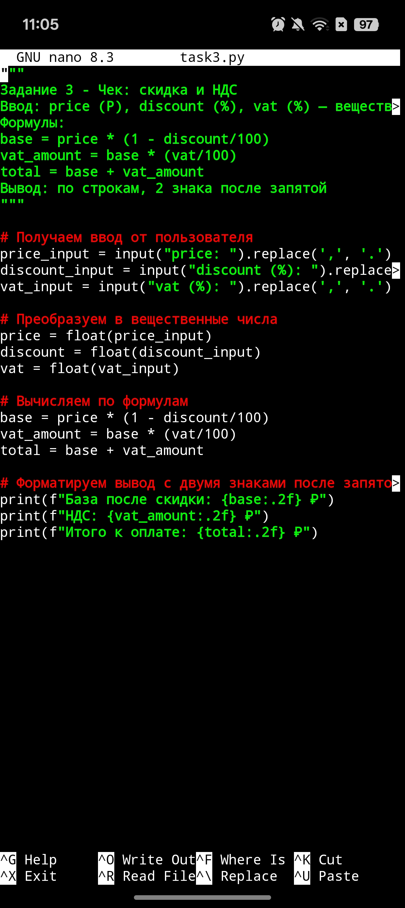
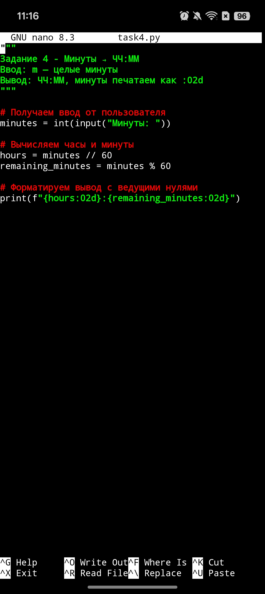
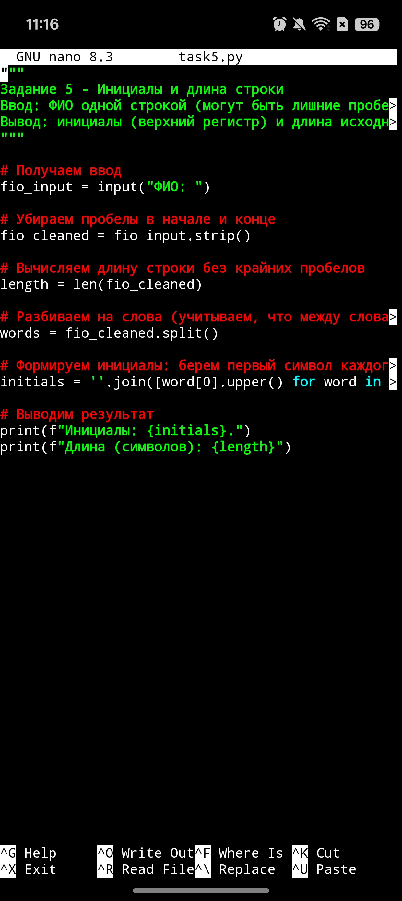
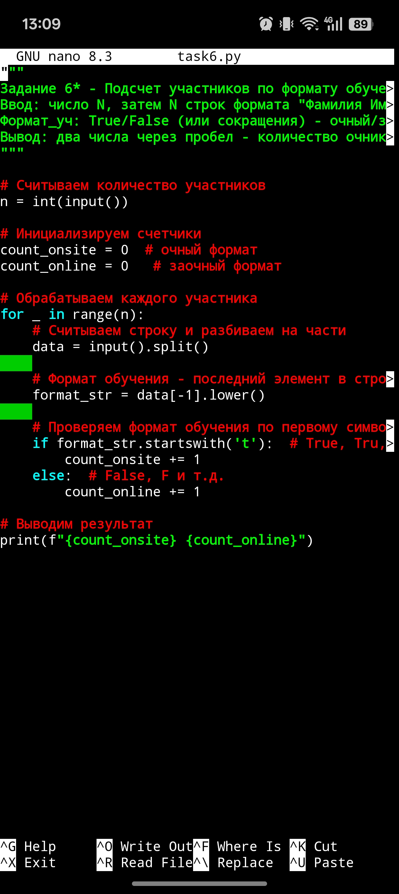
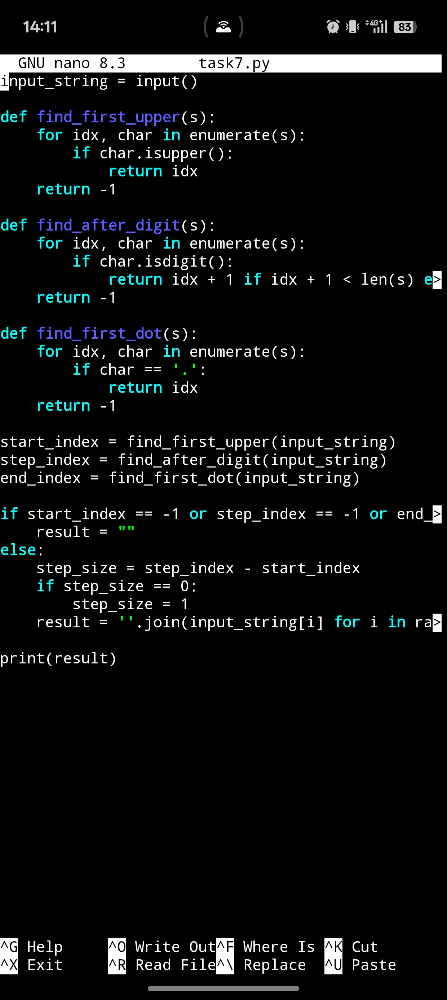

 # ЛР1

## Задание 1 - Приветствие и возраст

## Задание 2 - Сумма и среднее

## Задание 3 - Чек: скидка и НДС

## Задание 4 - Минуты → ЧЧ:ММ

## Задание 5 - Инициалы и длина строки

## Задание 6* - Подсчет участников

## Задание 7* - Расшифровка строки

